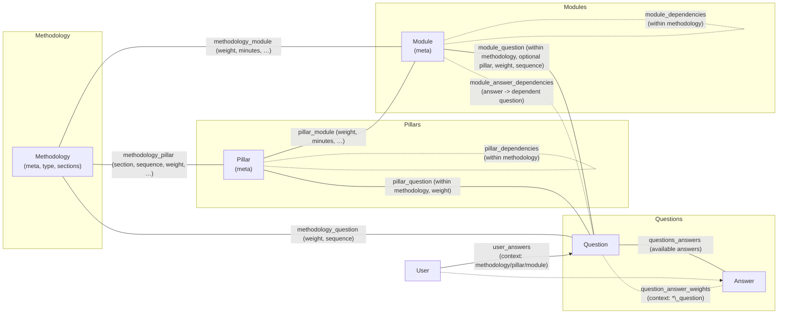

## Database schema and relationships

This document explains the core tables, how they relate, and what they are used for in the application. It includes both a high‑level conceptual diagram and a detailed ER diagram.

### Conceptual overview



### Detailed ER diagram

```mermaid
erDiagram
  ROLES ||--o{ USERS : has
  ROLES {
    bigint id PK
    enum name "SuperAdmin|Admin|Expert|Customer"
  }

  USERS {
    bigint id PK
    string name
    string email
    timestamp email_verified_at
    string password
    string otp
    timestamp otp_expires_at
    boolean active
    enum gender "male|female"
    date birthDate
    bigint roleId FK
  }

  TAGS {
    bigint id PK
    string title
    boolean active
  }

  METHODOLOGY ||--o{ METHODOLOGY_PILLAR : groups
  METHODOLOGY ||--o{ METHODOLOGY_MODULE : groups
  PILLARS ||--o{ METHODOLOGY_PILLAR : in
  MODULES ||--o{ METHODOLOGY_MODULE : in

  METHODOLOGY {
    bigint id PK
    string name
    text description
    text definition
    longtext objectives
    enum type "simple|complex|twoSection"
    string first_section_name
    string second_section_name
    string pillars_definition
    string modules_definition
    json tags
    string img_url
    longtext first_section_definition
    longtext first_section_objectives
    string first_section_img_url
    longtext second_section_definition
    longtext second_section_objectives
    string second_section_img_url
    longtext questions_description
    string questions_estimated_time
    int questions_count
    longtext first_section_description
    longtext second_section_description
    timestamps
  }

  PILLARS ||--o{ PILLAR_MODULE : has
  MODULES ||--o{ PILLAR_MODULE : in

  PILLARS {
    bigint id PK
    string name
    text description
    text definition
    longtext objectives
    string img_url
    json tags
    boolean active
    timestamps
  }

  MODULES {
    bigint id PK
    string name
    text description
    text definition
    longtext objectives
    string img_url
    json tags
    boolean active
    longtext questions_description
    string questions_estimated_time
    int questions_count
    timestamps
  }

  METHODOLOGY_PILLAR {
    bigint id PK
    bigint methodology_id FK
    bigint pillar_id FK
    enum section "first|second"
    int sequence
    int number_of_modules
    decimal weight
    longtext questions_description
    int questions_estimated_time
    timestamps
  }

  METHODOLOGY_MODULE {
    bigint id PK
    bigint methodology_id FK
    bigint module_id FK
    int number_of_questions
    decimal weight
    int minutes
    text report
    longtext questions_description
    int questions_estimated_time
    timestamps
  }

  PILLAR_MODULE {
    bigint id PK
    bigint methodology_id FK
    bigint pillar_id FK
    bigint module_id FK
    int number_of_questions
    decimal weight
    int minutes
    text report
    longtext questions_description
    int questions_estimated_time
    timestamps
  }

  PILLAR_DEPENDENCIES {
    bigint id PK
    bigint methodology_id FK
    bigint pillar_id FK
    bigint depends_on_pillar_id FK
    timestamps
  }

  MODULE_DEPENDENCIES {
    bigint id PK
    bigint methodology_id FK
    bigint module_id FK
    bigint depends_on_module_id FK
    timestamps
  }

  QUESTIONS ||--o{ QUESTIONS_ANSWERS : has
  ANSWERS ||--o{ QUESTIONS_ANSWERS : in

  QUESTIONS {
    bigint id PK
    string title
    enum type "YesNo|TrueFalse|MCQSingle|MCQMultiple|Rating1to5|Rating1to10|ScaleAgreeDisagree"
    json tags
    boolean active
    timestamps
  }

  ANSWERS {
    bigint id PK
    string title
    timestamps
  }

  QUESTIONS_ANSWERS {
    bigint id PK
    bigint question_id FK
    bigint answer_id FK
    timestamps
    unique "(question_id, answer_id)"
  }

  %% Question placement within each context level
  METHODOLOGY ||--o{ METHODOLOGY_QUESTION : asks
  PILLARS ||--o{ PILLAR_QUESTION : asks
  MODULES ||--o{ MODULE_QUESTION : asks

  METHODOLOGY_QUESTION {
    bigint id PK
    bigint methodology_id FK
    bigint question_id FK
    decimal weight
    int sequence
    timestamps
    unique "(methodology_id, question_id)"
  }

  PILLAR_QUESTION {
    bigint id PK
    bigint methodology_id FK
    bigint pillar_id FK
    bigint question_id FK
    decimal weight
    timestamps
    unique "(methodology_id, pillar_id, question_id)"
  }

  MODULE_QUESTION {
    bigint id PK
    bigint methodology_id FK
    bigint module_id FK
    bigint pillar_id FK nullable
    bigint question_id FK
    decimal weight
    int sequence
    timestamps
    unique "(methodology_id, module_id, question_id)"
  }

  ANSWER_CONTEXTS {
    bigint id PK
    enum context_type "methodology_question|pillar_question|module_question"
    bigint context_id
    bigint answer_id FK
    decimal weight
    enum dependent_context_type "methodology_question|pillar_question|module_question" nullable
    bigint dependent_context_id nullable
    timestamps
    unique "(context_type, context_id, answer_id)"
  }

  // MODULE_ANSWER_DEPENDENCIES table removed; dependencies now stored in ANSWER_CONTEXTS

  USERS ||--o{ USER_ANSWERS : submits
  QUESTIONS ||--o{ USER_ANSWERS : answered
  ANSWERS ||--o{ USER_ANSWERS : chosen

  USER_ANSWERS {
    bigint id PK
    bigint user_id FK
    enum context_type "methodology|pillar|module"
    bigint context_id
    bigint question_id FK
    bigint answer_id FK
    timestamps
  }
```

### Table purposes and usage

- **roles**: Defines application roles. Used by `users.roleId` and `App\Models\Role` ↔ `App\Models\User`.
- **users**: End users and admins. Answers are captured in `user_answers`.
- **tags**: Simple lookup for reusable labels. Core entities (`methodology`, `pillars`, `modules`, `questions`) also store JSON tags inline for fast filtering.

- **methodology**: A questionnaire blueprint. Supports types and optional two-section breakdown with section meta fields. Top-level questions attach via `methodology_question`. Also groups `pillars` and/or `modules`.
- **pillars**: Thematic groups inside a `methodology`. Can contain `modules` and their own questions via `pillar_question` scoped to a methodology.
- **modules**: Finer-grained units under a `methodology` (directly or under a `pillar`). Module-scoped questions via `module_question`.

- **methodology_pillar**: Links pillars to a methodology with additional fields: `section`, `sequence`, `number_of_modules`, `weight`, and questions meta for that pillar within the methodology.
- **methodology_module**: Links modules directly to a methodology with `number_of_questions`, `weight`, `minutes`, `report`, and questions meta.
- **pillar_module**: Links modules under a pillar within a methodology with `number_of_questions`, `weight`, `minutes`, `report`, and questions meta.
- **pillar_dependencies**: Within a methodology, a pillar can depend on another pillar.
- **module_dependencies**: Within a methodology, a module can depend on another module.

- **questions**: Question bank. Types include Yes/No, MCQ, Rating, etc.
- **answers**: Answer bank. The base set of allowed answers per question is defined through `questions_answers`.
- **questions_answers**: Many-to-many mapping between questions and their available answers.

- **methodology_question**: Places a question at the methodology level with `weight` and `sequence`.
- **pillar_question**: Places a question at the pillar level within a given methodology with `weight`.
- **module_question**: Places a question at the module level within a methodology; optionally tied to a specific pillar; includes `weight` and `sequence`.
- **answer_contexts**: Stores context-specific weights for an answer option depending on where the question appears. Optional dependency points to another context row via `dependent_context_type` + `dependent_context_id` to indicate question flow.

- **user_answers**: Records a user's selected `answer` to a `question` within a context (`methodology`, `pillar`, or `module`).

### How models use these relations (selected)

- `App\Models\Methodology`
  - `pillars()` ↔ `methodology_pillar`
  - `modules()` ↔ `methodology_module`
  - `questions()` ↔ `methodology_question` (with `weight`, `sequence`)
  - `pillarQuestions()` ↔ `pillar_question` (with `pillar_id`, `weight`)
  - `moduleQuestions()` ↔ `module_question` (with `module_id`, `pillar_id`, `weight`)
  - `pillarModules()` ↔ `pillar_module` (with `pillar_id`)

- `App\Models\Pillar`
  - `methodologies()` ↔ `methodology_pillar` (with `section`)
  - `modules()` / `modulesForMethodology()` ↔ `pillar_module`
  - `questions()` / `questionsForMethodology()` ↔ `pillar_question` (scoped by `methodology_id`)
  - `dependsOn()` / `dependedBy()` ↔ `pillar_dependencies`

- `App\Models\Module`
  - `methodologies()` ↔ `methodology_module`
  - `pillars()` / `pillarsForMethodology()` ↔ `pillar_module`
  - `questions()` / `questionsForMethodology()` / `questionsForPillarInMethodology()` ↔ `module_question`

- `App\Models\Question`
  - `answers()` ↔ `questions_answers`
  - `methodologies()` / `pillars()` / `modules()` ↔ respective question placement tables
  - `answerWeights()` ↔ `question_answer_weights`

- `App\Models\Answer`
  - `questions()` ↔ `questions_answers`
  - `answerWeights()` ↔ `question_answer_weights`

- `App\Models\UserAnswer`
  - `user()` ↔ `users`
  - `question()` ↔ `questions`
  - `answer()` ↔ `answers`
  - `context()` is a morph to the context entity; persisted as `context_type` + `context_id` (here stored as string type plus id for methodology/pillar/module context).

### Notes

- Many link tables include unique constraints to prevent duplicate associations (e.g., `(methodology_id, question_id)` in `methodology_question`).
- The app stores presentation/meta fields (like `questions_description`, `minutes`, `report`) on the appropriate pivot to reflect context-specific wording and stats.
- For answer scoring, always look up weights in `question_answer_weights` using the specific placement row (`*_question`).


